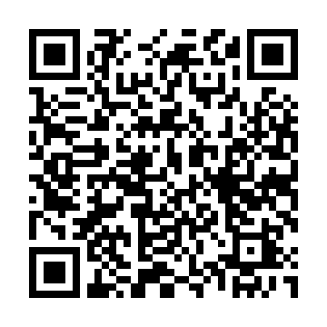

# Verdant Pass

A custom Mario Kart 7 track, shipped as a 3DS app that builds it onto your SD
card.

Run the app once and it writes the track out as a mod that
[Hotswap](https://github.com/stevenjc2009-byte/Hotswap) can switch on and off.
Stock Mario Kart 7 keeps working exactly as it did; you swap to Verdant Pass
when you want it and back to Stock when you don't.

The track replaces **Kalimari Desert** in the Lightning Cup, and renames it in
all eight European languages.

## Install



Scan that with FBI's *Remote Install → Scan QR Code*, or download
[`verdantpass1.1.3.cia`](https://github.com/stevenjc2009-byte/mk7-verdant-pass/releases/download/v1.1.3/verdantpass1.1.3.cia)
and install it with FBI by hand.

Once it is on, later versions install themselves — see [Updates](#updates).

## Using it

1. **Open Verdant Pass** from the HOME menu and tap **Install track** (or press
   **A**). It reads your copy of Mario Kart 7, builds the nine modded files,
   and writes them to `sdmc:/hotswap/mk7/Verdant Pass/`.
2. **Open Hotswap**, pick Mario Kart 7, and choose **Verdant Pass**.
3. **Launch Mario Kart 7** and go to the Lightning Cup.

To go back to normal, open Hotswap and switch Mario Kart 7 to **Stock**.

### You need

- A 3DS with **Luma3DS** and custom firmware.
- **Luma3DS game patching turned on** — hold SELECT on boot, and enable
  *Enable game patching*. Without it Luma ignores the swapped-in files and you
  get stock Kalimari Desert with nothing to say why.
- **Hotswap**, which is what actually swaps the track in and out.
- **Your own copy of Mario Kart 7's stock files on the SD card**, in
  `sdmc:/verdantpass/game/` — see [Giving it the game
  files](#giving-it-the-game-files). The install works by reading your own game;
  there is no copy of Nintendo's data inside this app to fall back on.

### Giving it the game files

The console does not let an installed app read another game's files. A title can
open its own RomFS and nothing else, and the answer to asking anyway is
`0xD9004676` — *no access rights for this command*. That is not a permission
this app can request; homebrew that offers the same feature, such as RomFS
Explorer, marks it `.3dsx`-only for the same reason.

So you hand it the files yourself, once, with **GodMode9**:

1. Boot GodMode9 — hold **START** while powering the console on.
2. Find Mario Kart 7's NCCH:
   - **Installed copy** — `[A:] SDCARD` → `title` → `00040000` → `00030700` for
     Europe (`00030800` Americas, `00030600` Japan, `00030a00` Korea) →
     `content` → the largest `.app`.
   - **Cartridge** — `[C:] GAMECART` → the `.3ds` → **A** → *Mount image to
     drive* → `content0.game`.
3. Press **A** on it and pick *Mount image to drive*. Open the `romfs` folder
   that appears.
4. Copy these nine files out — press **A** on each, then *Copy to 0:/gm9/out*:
   - `Course/Gn64_KalimariDesert.szs`
   - `UI/common-ed.szs`, `common-ee.szs`, `common-ef.szs`, `common-ei.szs`,
     `common-en.szs`, `common-ep.szs`, `common-er.szs`, `common-es.szs`
5. Move all nine from `0:/gm9/out/` into `0:/verdantpass/game/`. They can sit
   loose in that one folder; the `Course/` and `UI/` folders do not have to be
   recreated.

**Or copy the whole thing instead of nine files.** In step 3, rather than
opening `romfs`, press **A** on `romfs.bin` next to it and *Copy to 0:/gm9/out*,
then move it to `0:/verdantpass/mk7-romfs.bin`. The app mounts that image
directly. It is around 600 MB against 2.5 MB for the nine files, so take this
route only if the card has room to spare.

Either way the files stay on your card and never leave it.

### Updates

Tap **Check for updates** (or press **Y**) to ask GitHub for a newer version.
If there is one it downloads and installs it, then relaunches. The bar on the
top screen moves the whole time, so a slow download looks slow rather than
looking hung.

The track lives inside the app, so a new track version *is* a new app version:
after updating, install again to write the newer track to the card.

The check needs an internet connection and only works on the installed CIA —
the `.3dsx` build has no way to install a title, so the button is greyed out
there.

## If it refuses

> *Verdant Pass is swapped in right now. Open Hotswap, switch Mario Kart 7 back
> to Stock, then run this again.*

That is the app declining to fight Hotswap for the files. While the mod is
swapped in, Hotswap has renamed its folder away into `/luma/titles/`, and
writing a fresh copy underneath would leave two of them and a state file that
disagrees with the disk. Swap back to Stock first.

> *Mario Kart 7 is here (…), but the console will not let an installed app read
> another game's files.*

It found your game and was refused. Expected on an installed CIA — follow
[Giving it the game files](#giving-it-the-game-files) and run it again.

> *Mario Kart 7 was not found on this console, and there is nothing in
> sdmc:/verdantpass/game/ either.*

Neither route worked. It asked the title database for anything calling itself
`CTR-P-AMK` on the SD card and the game card, tried the European, American,
Japanese and Korean title IDs blind, and then looked for the files on the card.
If you have the game, the SD copy is what you want:
[Giving it the game files](#giving-it-the-game-files).

> *A file is missing from this copy of Mario Kart 7.*

`sdmc:/verdantpass/game/` exists but one of the nine is not in it. Check all
nine names against the list above — a missing UI language counts.

## How it works

**The app ships none of Nintendo's data.** What it carries is the three files
this project generated — the track model, the collision mesh and the course
layout — and it reads everything else out of your own copy of the game,
assembling the finished files on the console.

The course archive has fifteen entries and only three of them are ours; the
eight UI archives are entirely Nintendo's with one string changed. Shipping
those finished archives would mean redistributing 943,342 bytes of Nintendo's
data. Building them on-device means shipping none.

So on install the app:

1. Opens your game's files (`gamefs.c`) — the title's own RomFS when the console
   permits it, otherwise your copies on the SD card.
2. Reads `Course/Gn64_KalimariDesert.szs`, decompresses the Yaz0, swaps our
   three entries into the SARC, rebuilds and recompresses (`szs.c`, `sarc.c`,
   `patch.c`).
3. Does the same for each of the eight `UI/common-e?.szs`, editing message 129
   in the `MsgStdBn` table to read *Verdant Pass* (`msbt.c`).
4. Writes the nine files into Hotswap's layout, reading each one's size back
   off the card afterwards.

None of that touches a 3DS API, which is why the whole recipe is covered by
host tests that compare its output against the PC toolchain that built the
track in the first place.

## What is in the app

- `romfs/mod/course.bcmdl` — the track model. Ours.
- `romfs/mod/course.kcl` — the collision mesh. Ours.
- `romfs/mod/course.kmp` — the course layout: route, checkpoints, objects,
  the start line. Ours.
- `romfs/cacert.pem` — the CA bundle the update check needs. The console's own
  root store predates every certificate authority in use today.

## Building it

Needs [devkitPro](https://devkitpro.org/) with `3ds-dev`, plus `3ds-curl` and
`3ds-mbedtls` for the updater.

```bash
make        # verdantpass.3dsx
make cia    # verdantpass.cia
```

Build in the devkitPro MSYS2 shell. `-Werror` is on, so a warning is a failed
build.

The icon and the HOME menu banner are drawn from primitives by
`tools/make_art.py` — see [docs/art.md](docs/art.md). Nothing in them is
traced, sampled or exported from anywhere.

### Tests

The patch engine, the install engine and the front end's button logic are all
plain C with no 3DS API in them, so they compile and run on the host:

```bash
sh test/run.sh
```

That builds three suites, runs them against a real Mario Kart 7 extract, and
then has the project's Python toolchain read back what the C wrote:

- **ui model** — which buttons exist in each state, where they are, and what a
  tap on any given pixel does.
- **patch engine** — Yaz0 round-trips, the rebuilt course archive is
  byte-identical to the PC toolchain's, Nintendo's twelve entries come through
  untouched, and garbage or a wrong archive is refused.
- **install engine** — the real `vp_install` against the real extract: nine
  files, in order, each decompressing to the expected archive, and all four
  ways Hotswap's state file can say "don't".

The suite needs a ROM extract, which is not in this repository. Point
`MK7_MOD_ROOT` at one, or the run skips — loudly.

It does not cover the drawing, the updater, or `gamefs.c` — those need a 3DS.

## Legal

This is a fan-made modification and is not affiliated with or endorsed by
Nintendo. It contains no Nintendo data: the track, the icon and the banner are
original work, and everything else is read out of the copy of the game already
on your console. Mario Kart 7 is © Nintendo.
